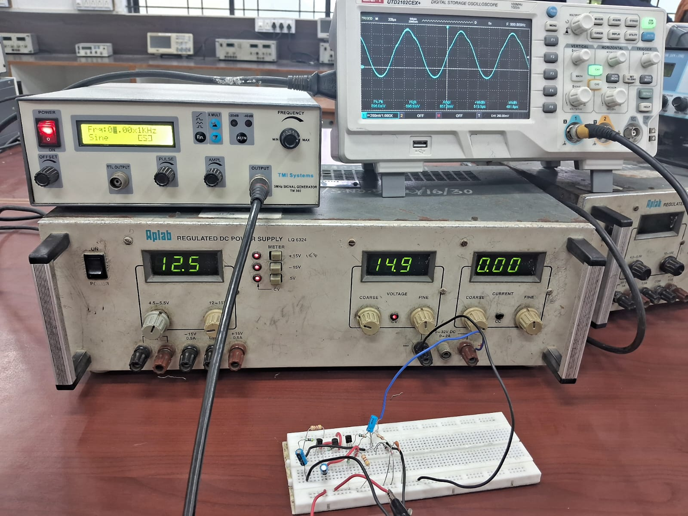

# Audio-Compressor

## Overview

This project implements an analog dynamic range compressor using discrete transistor stages. It is suitable for:

- Audio pre-processing
- Microphone signal conditioning
- DIY audio systems
- Amateur radio audio chains

---

## Features

- Automatic gain reduction
- Low component count
- Simple power supply (15–20V)
- Built with commonly available components
- Easy PCB implementation

## Circuit Diagram

## Components

| Reference | Value |
|------------|---------|
| Q1-Q3 | BC549 |
| D1-D2 | 1N914 |
| R1 | 10K |
| R2 | 4.7K |
| R3 | 470Ω |
| R4 | 4.7K |
| R5 | 470Ω |
| R6 | 470Ω |
| R7 | 270K |
| C1 | 10µF |
| C2 | 10µF |
| C3 | 10µF |
| C4 | 220pF |

---

## How It Works

1. Audio enters through C1.
2. Q3 amplifies the signal.
3. D1 and D2 detect peaks.
4. Q1 and Q2 create automatic gain control.

## Input Waveform

## Output Waveform

## Prototype

   
6. Output level remains more consistent.

